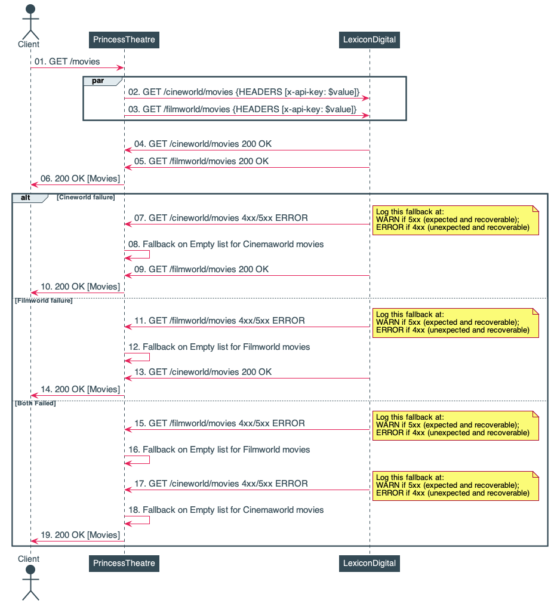

# Context

An API which returns movies from Cineworld and Filmworld along with their cost.

#Sequence Diagram

#Start the application locally 

* execute `./gradlew bootRun --args='--spring.profiles.active=local'` and access application at http://localhost:8080/ 

#Build locally

* execute `./gradlew clean test`
 
#API Documentation

Available at http://localhost:8080/ and http://localhost:8080/api-doc/index.html
 
#Further Improvements to consider

* Fallback on a *Cached* copy of Lexicon movies if Upstream requests fail 
    * Ideally via a transparent HTTP caching proxy like Nginx 
 
  